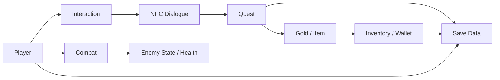
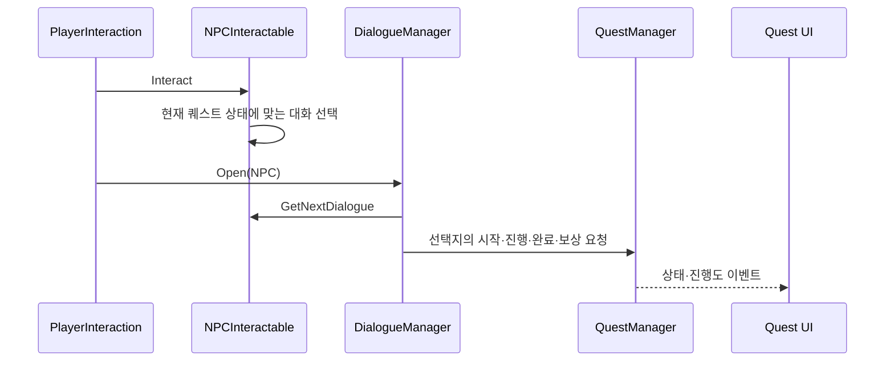
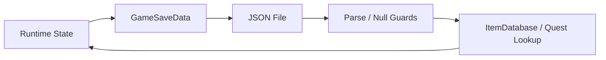

# Architecture

## 시스템 개요

플레이어 행동을 중심으로 상호작용, 퀘스트, 전투, 인벤토리, 저장 시스템이 연결됩니다. 런타임 상태를 관리하는 클래스와 화면 표시를 담당하는 클래스를 분리하고, 주요 상태 변경은 이벤트로 전달합니다.

## 책임 구분

| 영역 | 주요 클래스 | 책임 |
|---|---|---|
| 퀘스트 데이터 | `QuestData` | 상태 전이, 목표 수량, 진행도, 완료·보상 가능 여부 |
| 퀘스트 조정 | `QuestManager` | 퀘스트 검색, 진행·완료·보상 요청, 추적 대상, 이벤트 발행 |
| 대화 | `NPCInteractable`, `DialogueManager` | 퀘스트 상태에 맞는 대화 선택, 문장·선택지 진행, 퀘스트 동작 호출 |
| 인벤토리 | `PlayerInventory`, `InventoryEntry` | 아이템 수량 추가·차감·조회, 컬렉션 보호, 변경 알림 |
| 플레이어 전투 | `PlayerCombat`, `PlayerHealth` | 공격 입력·판정·쿨다운, 피해·사망 상태 |
| 적 전투 | `EnemyAI`, `EnemyHealth`, `EnemyKnockback` | 추적·공격 전환, 피해·사망, 넉백 중 행동 제한 |
| 저장 | `SaveManager`, `GameSaveData` | 런타임 상태를 값 중심 데이터로 변환하고 JSON으로 저장·복원 |
| 표시 | 인벤토리·퀘스트·체력 UI | 상태 변경 이벤트 구독과 화면 갱신 |

## 퀘스트와 대화 흐름

`QuestData`는 `NotStarted → InProgress → Completed → Rewarded` 전이를 관리합니다. `QuestManager`는 외부 시스템의 요청을 받아 해당 퀘스트를 찾고, 성공한 변경만 이벤트로 알립니다. NPC는 퀘스트 상태에 따라 기본·진행·완료·보상 이후 대화를 선택합니다.

## 전투 흐름

`PlayerCombat`은 공격 입력과 쿨다운을 확인한 뒤 공격 지점의 범위 판정을 수행합니다. 발견한 대상은 `IDamageable`을 통해 피해를 받으므로 공격 로직과 체력 구현이 분리됩니다.

`EnemyAI`는 플레이어와의 거리에 따라 대기, 추적, 공격 상태를 전환합니다. 공격 시작 거리보다 공격 종료 거리를 크게 두어 경계 부근에서 상태가 매 프레임 왕복하는 현상을 줄였습니다. 넉백과 사망 상태에서는 일반 이동·공격 흐름을 제한합니다.

## 인벤토리와 UI 동기화

`PlayerInventory`는 내부 목록을 읽기 전용으로 공개하고, 모든 수량 변경을 추가·제거 메서드로 제한합니다. 동일 아이템은 `InventoryEntry`의 수량으로 합산합니다.

- 항목 변경: `InventoryChanged`
- 전체 초기화: `InventoryReset`

UI는 두 이벤트를 구독합니다. 저장 데이터를 불러오기 위해 인벤토리를 비울 때도 초기화 이벤트가 발생하므로, 저장된 아이템이 없는 경우까지 화면과 데이터가 일치합니다.

## 저장과 복원 경계

`GameSaveData`에는 위치, 체력, 소지금, 인벤토리 항목, 퀘스트 상태처럼 복원에 필요한 값만 담습니다. ScriptableObject나 MonoBehaviour 참조는 저장하지 않고 `itemId`, `questId`로 다시 연결합니다.

불러오기 과정에서는 파일 읽기와 JSON 변환 실패, null 데이터·목록, 등록되지 않은 ID를 확인합니다. 유효하지 않은 개별 항목은 경고 후 건너뛰며, 필수 매니저나 아이템 데이터베이스가 없으면 저장 또는 복원을 시작하지 않습니다. 기존 저장 데이터 구조는 유지합니다.

## 소스 공개 범위

게임플레이 로직을 검토하는 데 필요한 `Assets/Scripts`와 설계 문서만 포함합니다. Scene, Prefab, 외부 아트·폰트 리소스가 없으므로 이 저장소만으로 Unity 프로젝트를 실행하는 구성은 아닙니다.
